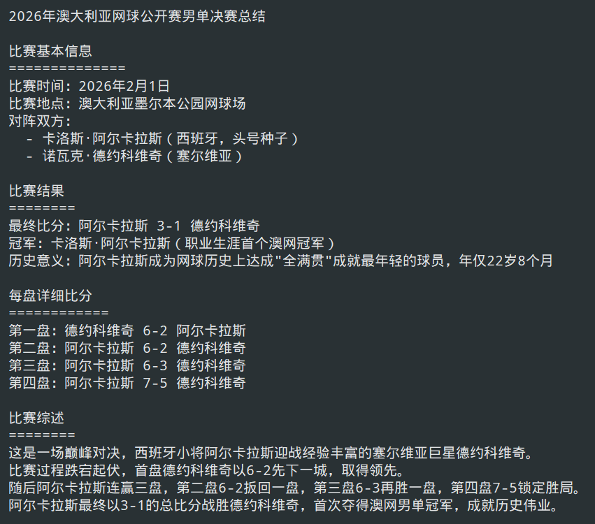
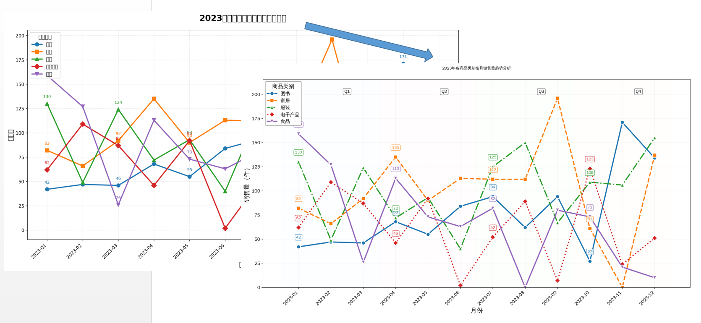

# 🦞 mini_lobster - 轻量级AI智能体框架

> 最近爆火的OpenClaw的极简实现，身形小巧但潜力无穷！你可以开发并加入自己的工具API，进行无限扩展。

[](https://www.python.org/downloads/)
[](https://opensource.org/licenses/MIT)

## 📖 项目简介

**mini_lobster** 是一个轻量化的AI智能体（Agent）框架，灵感源自OpenClaw的"让AI动手干活"理念。核心思想是：**大模型负责思考决策，工具负责执行操作**。

与OpenClaw的宏大架构不同，mini_lobster专注于最实用的核心功能：
- 🤔 **模型思考**：接入大模型进行任务规划
- 🔧 **工具调用**：AI自主决定调用哪些工具
- 📝 **任务执行**：自动完成复杂任务并生成结果

## ✨ 核心特性

| 特性 | 说明 |
|------|------|
| 🧩 **智能体核心** | 自主规划、迭代执行、自我验证的任务处理流程 |
| 🔨 **工具集** | 百度搜索、Python代码执行、图像分析，即插即用 |
| 🤖 **多模型支持** | 灵活的模型客户端配置，可对接不同大模型 |
| 📊 **任务追踪** | 完整的日志系统，记录每一步思考和操作 |

## 🧰 **智能工具注册机制**

mini_lobster 配备了**自动化工具管理系统**，让功能扩展变得前所未有的简单：

| 特性 | 说明 |
|------|------|
| 🎯 **一键注册** | 用 `@tool` 装饰器轻松将任何函数变为AI可用工具 |
| 🔍 **自动发现** | 启动时自动扫描 `tools/` 目录，新工具即写即用，无需手动配置 |
| 📋 **智能Schema生成** | 自动解析函数签名、参数类型和文档字符串，生成符合OpenAI标准的工具描述 |
| 🧩 **参数描述定制** | 通过 `param_descriptions` 为AI提供更精准的参数使用指引 |
| 📦 **单例管理** | 全局统一的工具注册器，避免重复注册和资源冲突 |
| 🔄 **运行时执行** | 根据AI的调用请求，动态执行对应的工具函数并返回结果 |

**示例：创建一个新工具只需三步**
```python
from core.tool_registry import tool

@tool(param_descriptions={"city": "要查询天气的城市名称"})
def get_weather(city: str, unit: str = "celsius") -> str:
    """获取指定城市的实时天气信息"""
    # 你的天气API调用逻辑
    return f"{city}天气：晴朗，25°{unit[0].upper()}"
```
保存到 `tools/weather_tool.py`，然后在`tools/core_tools.py`顶部导入（`from tools import weather`），重启即用！AI智能体会自动理解并使用这个工具。

mini_lobster借此具备了**无限扩展的可能性**——无论是接入企业内部API、自定义数据处理逻辑，还是集成第三方服务，都能通过简单的装饰器快速实现，真正做到“即插即用”。

## 🎯 它能做什么？

### 案例1：信息查询+文档生成
> “查询2026年澳网男单决赛情况，总结成文档，需要每盘详细比分”

Agent会：
1. 🔍 调用百度搜索获取比赛信息
2. 📝 用Python代码生成格式规范的txt文档
3. ✅ 验证文件是否成功创建
4. 🎉 返回最终结果
5. 请参考examples/AustralianOpen2026/agent.log



### 案例2：数据处理+可视化
> “处理杂乱的销售数据文件，按商品类别画按月销售量折线图”

Agent会：
1. 📂 自动检测不同格式的文件（.tsv、.txt、混合分隔符）
2. 🧹 智能清洗数据，处理缺失值
3. 📊 用matplotlib生成折线图
4. 🔍 **发现问题**：用图像分析工具检查图表时，发现所有汉字都显示为方框
5. 🛠️ **自动修复**：编写代码搜索系统字体，重新配置matplotlib中文字体支持
6. ✅ **验证结果**：再次分析图表，确认汉字正常显示
7. 📈 输出最终分析报告
8. 请参考 `examples/SalesDataVisulization/agent.log`


**执行亮点**：
- 第一次图像分析时，虽然文字全是方框，但模型仍能通过颜色和标记准确描述5条数据线的趋势
- 发现问题后主动修复，第二次验证时汉字已正常显示
- 整个过程无需人工干预，模型自主完成了"发现问题→定位原因→修复问题→验证效果"的闭环

### 案例3：图像分析+自我纠错
> “工作目录中有一张图片，请告诉我图片内容是什么。”

Agent会：
1. 🔍 首次尝试直接调用图像分析工具
2. ❌ 工具调用失败（返回FAILED）
3. 🔧 自动切换策略：用Python代码查找目录中的图片文件
4. 🖼️ 找到图片后再次调用图像分析工具
5. 📝 成功分析图片内容（识别出航空母舰、舰型特征、环境细节等）
6. ✅ 验证任务完成，返回详细描述
7. 请参考 `examples/ImageAnalysis/agent.log`


**执行过程简览**：

| 迭代 | 工具调用 | 目的 | 结果 |
|------|----------|------|------|
| 1 | `analyze_image` | 直接分析图片 | ❌ 失败 |
| 2 | `execute_python_code` | 查找目录中的图片 | ✅ 找到 `fjj.jpeg` |
| 3 | `analyze_image` | 再次分析图片 | ✅ 成功识别航母 |
| 4 | `verify_task_completion` | 验证任务完成 | ✅ 确认完成 |
| 5 | `finalize_session` | 返回结果 | ✅ 结束 |

**图像分析结果摘要**：
> 这是一艘在广阔海面上航行的现代化航空母舰，舰体主要为白色，舰岛高耸，飞行甲板宽阔平整，划有黄色和白色标线。海面深蓝色，波浪起伏，天空晴朗。远处可见另一艘小型船只。整体传达出强大的军事力量感与科技感，极有可能是中国海军的“辽宁舰”或“山东舰”。

## 🚀 快速开始

> # **🚨 超级重要警告 🚨 !!! 强烈建议在 Docker 中运行 !!!** 
> 
> ## **mini_lobster 的 Python 代码执行器具有执行任意系统命令的潜力！**
>
> ### 🔥 **风险提示：**
> - Agent 可以动态生成并执行 Python 代码
> - 代码可以访问文件系统、执行 shell 命令、修改环境
> - **如果在宿主机直接运行，存在潜在安全风险**
>
> ### 📦 **Docker 隔离带来的好处：**
> - 🛡️ **文件系统隔离** - 限制在容器内
> - 🔒 **网络隔离** - 可精细控制
> - 📊 **资源限制** - 防止失控
> - 🧹 **一键清理** - 用完即焚
>
> ### ⚡ **切勿在以下环境直接运行：**
> - ❌ 生产服务器
> - ❌ 个人电脑（无隔离）
> - ❌ 共享系统
> - ❌ 包含敏感数据的机器
>
> ### 🔐 安全建议：
> 
> Docker 运行是**最低要求**，但不是**绝对安全**。建议：
> 
> ### 最低安全配置
> ```bash
> docker run --rm \
>   --read-only \
>   --cap-drop=ALL \
>   --security-opt=no-new-privileges \
>   --cpus=1 --memory=1g \
>   -v ./workspace:/app/workspace:ro \
>   mini_lobster
>
> ---
> 
> **安全第一！Docker 是你的安全带！** 🦞

### 环境要求
- Python 3.10+
- pip 包管理工具
- 建议在Docker中启动！将需要涉及的文件夹做一次映射

### 安装步骤

#### 1. 克隆项目
```bash
git clone https://github.com/McvLJY/mini_lobster.git
cd mini_lobster
```

#### 2. 安装依赖
```bash
pip install -r requirements.txt
```

#### 3. 配置参数

```bash
# 复制配置模板
cp utilities/PARAMS.py.example utilities/PARAMS.py
cp tasks/tasks.py.example tasks/tasks.py
```

编辑 `utilities/PARAMS.py`：

```python
# 必填配置
# ==========
# 工作目录：所有任务文件将保存在此目录下
base_wkd = './workspace'  # 可使用相对路径或绝对路径

# 主模型API密钥（建议使用线上模型，如DeepSeek）
DEEPSEEK_API_KEY = "your-deepseek-api-key-here"


# 可选配置
# ==========

# 百度搜索工具
# 可自行申请，每日1000次免费使用
BAIDU_SEARCH_API_KEY = "your-baidu-api-key-here"  # 不填写则搜索功能不可用

# 本地主模型配置（通过vLLM服务启动）
# 如果不使用本地模型，留空即可
MAIN_AGENT_BASE_URL = "http://localhost:8000/v1"
MAIN_AGENT_LOCAL_MODEL_ADDRESS = "your-vllm-model-path"
MAIN_AGENT_LOCAL_MODEL_MAX_TOKENS = 4096

# 本地视觉模型配置（用于图像分析工具）
# 如果不使用图像分析功能，留空即可
IMAGE_AGENT_BASE_URL = "http://localhost:8000/v1" 
IMAGE_AGENT_LOCAL_MODEL_ADDRESS = "your-vllm-vision-model-path"
IMAGE_AGENT_LOCAL_MODEL_MAX_TOKENS = 4096
```

#### 4. 配置任务

编辑 `tasks/tasks.py`，定义你想要执行的任务：

```python
from datetime import datetime
from utilities.PARAMS import base_wkd
import os

# 示例任务1：澳网信息查询
task_dir_01 = 'australian_open_2026'
wd_01 = os.path.join(base_wkd, task_dir_01)
australian_open_task = {
    'task_name': f"""你的工作目录是{wd_01}。请帮我查询一下2026年澳网男单决赛的情况，把概况总结一下，写成文档，保存在一个txt文件中。注意需要每一盘的详细比分。""",
    'task_dir': task_dir_01
}

# 你可以在这里添加更多任务...
# 例如：
# my_custom_task = {
#     'task_name': '你的任务描述',
#     'task_dir': 'your_task_dir'
# }
```

### 运行项目

#### 方式一：直接运行（使用 tasks.py 中定义的任务）

打开 `main.py`，找到这一行：

```python
# 测试任务
tasks = task_ds_09  # 修改这里为你想要执行的任务变量名
```

将其改为你在 `tasks.py` 中定义的任务名，例如：

```python
# 测试任务
tasks = australian_open_task  # 运行澳网查询任务
# tasks = sales_analysis_task  # 运行销售数据分析任务
```

然后运行：

```bash
python main.py
```

#### 方式二：快速测试不同任务

你也可以在 `main.py` 中临时切换任务：

```python
# 取消注释你想要运行的任务
tasks = australian_open_task      # 澳网查询
# tasks = sales_analysis_task     # 销售数据分析
# tasks = my_custom_task          # 你的自定义任务
```

### 查看运行结果

#### 生成的文件
每个任务会在 `workspace/` 下创建独立的目录，包含所有生成的文件：

```
workspace/
├── australian_open_2026/           # 澳网查询任务
│   ├── 2026年澳网男单决赛总结.txt   # 生成的文档
│   ├── agent.log                    # 任务流程日志
│   ├── conversation_history.log     # 完整对话历史
│   └── ai_responses.log             # AI思考过程
│
└── sales_data_analysis/             # 销售数据分析任务
    ├── monthly_sales_by_category_final.png  # 生成的折线图
    ├── sales_analysis_report.txt            # 分析报告
    ├── final_combined_sales.csv              # 清洗后的数据
    ├── agent.log
    ├── conversation_history.log
    └── ai_responses.log
```

#### 日志文件说明

| 日志文件 | 用途 | 查看方式 |
|---------|------|---------|
| `agent.log` | 记录任务流程、状态变化、工具调用 | `cat workspace/任务目录/agent.log` |
| `conversation_history.log` | 完整的对话历史（包括用户输入和AI回复） | `cat workspace/任务目录/conversation_history.log` |
| `ai_responses.log` | AI的思考过程和工具调用详情 | `cat workspace/任务目录/ai_responses.log` |

### 运行你自己的任务

1. **在 `tasks/tasks.py` 中添加你的任务**：
   ```python
   my_task_dir = 'my_custom_task'
   my_wd = os.path.join(base_wkd, my_task_dir)
   my_custom_task = {
       'task_name': f'你的工作目录是{my_wd}。在这里描述你的任务...',
       'task_dir': my_task_dir
   }
   ```

2. **在 `main.py` 中指向你的任务**：
   ```python
   tasks = my_custom_task
   ```

3. **运行**：
   ```bash
   python main.py
   ```

### 常见问题

**Q: 运行后没有生成任何文件？**
A: 检查 `PARAMS.py` 中的 `base_wkd` 是否正确，确保有写入权限。

**Q: 百度搜索不能用？**
A: 需要在 `PARAMS.py` 中配置 `BAIDU_SEARCH_API_KEY`。如果不配置，AI会跳过搜索工具。

**Q: 想用本地模型怎么配置？**
A: 先启动 vLLM 服务，然后在 `PARAMS.py` 中填写 `MAIN_AGENT_BASE_URL` 和相关配置。

**Q: 任务执行到一半卡住了？**
A: 查看 `workspace/任务目录/agent.log` 了解具体错误。常见原因：API密钥无效、网络问题、模型超时。

---

TIPS：如果没有任何外部工具，也不用担心！可以先尝试一些简单的本地任务。mini_lobster有Python执行工具，可以执行任意本地任务。

**现在你可以开始“养龙虾”了！🦞**